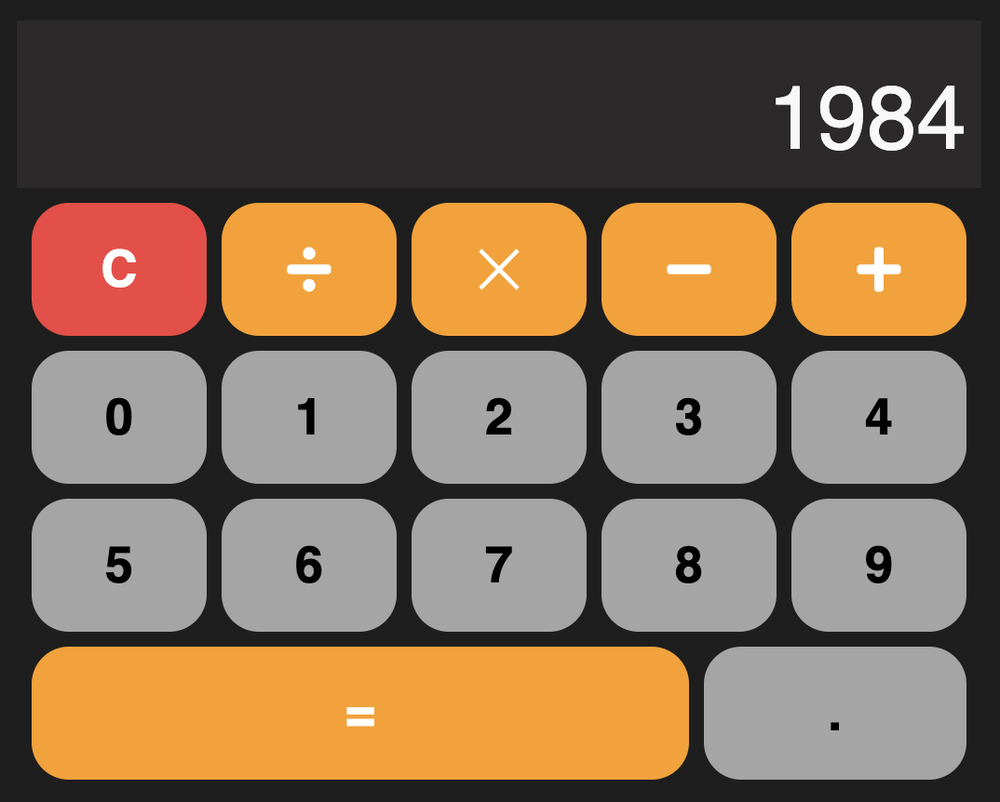

# Calculator React Task

## Task 🎯

1. İlk öncə projecti clone etdikden sonra terminalda **_npm install_** yazıb lazim olan **_node_modules_** folderini projecte insert edirik.
2. Projectin **UI** hissəsi hazırdır. Sadəcə lazım olan stateləri yaradıb onları doğru istifadə etmək lazımdır

---

#### ❗ Şərtlər:

1. **C**(Clear) buttonuna click etdikdə calculator reset olunmalıdır.

2. Birinci dəyəri daxil edib(**1900**) sonra hər hansı operator seçib(**-**) daha sonra ikinci dəyəri daxil edib(**300**), Bərabər buttonuna basdıqda nəticə əks olunmalıdır(**1600**)
3. Birinci dəyəri daxil edib(**1900**) sonra hər hansı operator seçib(**-**) daha sonra ikinci dəyəri daxil edib(**300**), Daha sonra isə yenidən operator(**+**) seçdikdə nəticə çap olunmalıdır(**1600**). Və ikinci dəyərin qəbul edilməsi gözlənilməlidir
4. Bir ədəddə yalnız bir ədəd  **.**(dot) ola bilər

[Live link](https://calculator-react-task.vercel.app/)

